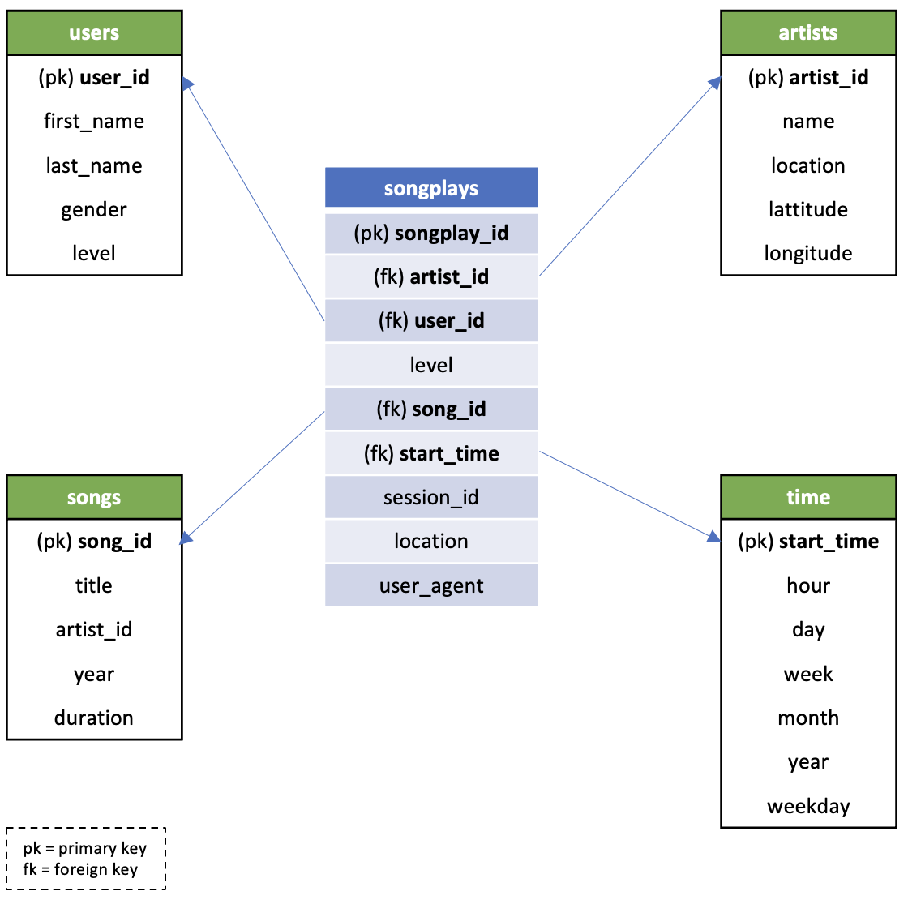

# Date Warehouse Project

## Description
This project takes JSON logs on user activity and song metadata and creates a fact table (**songplays**) and dimension tables (**users, songs, artists, time**) for a music streaming startup (Sparkify) in AWS. The ETL script in this project extracts JSON data from S3 and transforms it to create fact & dimension tables partitioned by month and year that are written back out to S3.

## Data

### Song Dataset

Here's an example of what a song JSON contains:

```json
{"num_songs": 1, "artist_id": "ARJIE2Y1187B994AB7", "artist_latitude": null,
"artist_longitude": null, "artist_location": "", "artist_name": "Line Renaud",
"song_id": "SOUPIRU12A6D4FA1E1", "title": "Der Kleine Dompfaff", "duration":
152.92036, "year": 0}
```

### Log Dataset

Here's an example of what a log JSON contains:

<p align="center">
  
</p>

### Schema

<p align="center">
  
</p>

## AWS Configuration File

The `dl.cfg` file takes important AWS information to programmatically create, edit, and delete AWS resources.

## Loading data

Run the `etl.py` script to in the terminal to produce fact and dimension tables in s3:

```bash
python etl.py
```